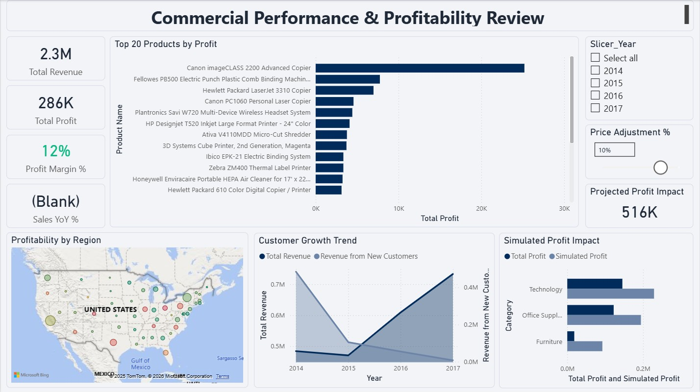

# Commercial Sales Performance & Profitability Suite



## 📊 Executive Summary
This project is a **senior-level commercial analysis** solution designed to go beyond basic reporting. It focuses on **Profitability, Margin Protection, and Scenario Planning** for a global retail operation.

Unlike standard dashboards that only track "Sales," this solution diagnoses *where* the company is losing money (Pareto Analysis) and allows stakeholders to simulate future pricing strategies (What-If Analysis).

---

## 💼 Business Case & Problem Statement

### The Challenge
The company possessed high-volume sales data but lacked visibility into **"True Profitability."** Revenue was growing, but net margins were inconsistent due to:
1.  **Uncontrolled Discounting:** Sales teams offering high discounts to close deals, eroding margins.
2.  **Product Portfolio Bloat:** A "long tail" of products generating minimal profit (Pareto principle).
3.  **Static Planning:** Inability to forecast how a 5-10% price increase would impact the bottom line.

### The Solution
I engineered a **Star Schema** data model and a dynamic Power BI report to:
* Identify the **top 20% of products** driving 80% of profits.
* Monitor **Year-over-Year (YoY) Growth** with time-intelligence functions.
* Simulate **Pricing Scenarios** to aid in Q4 budgeting strategies.

---

## 🛠 Technical Architecture

### 1. Data Engineering (Star Schema)
Transformed a flat 10,000-row `csv` file into a normalized model using **Power Query (M)** to optimize performance and data integrity.

* **Fact Table:** `Fact_Sales` (Transactions)
* **Dimension Tables:**
    * `Dim_Customer`: Unique Customer IDs (extracted from raw data).
    * `Dim_Product`: Handled duplicate Product Names via Grouping logic.
    * `Dim_Location`: Generated Surrogate Keys to resolve "Zip Code across multiple Cities" granularity issues.
    * `DateQuery`: M-generated continuous date table with Fiscal Year & Sorting columns.

### 2. Advanced DAX Measures
Moving beyond basic sums, I implemented complex logic for commercial insights.

#### **A. Pareto Analysis (80/20 Rule)**
*Dynamic calculation to identify high-value products.*
```dax
Pareto Profit % = 
VAR TotalAllProfit = CALCULATE([Total Profit], ALLSELECTED(Fact_Sales))
VAR CurrentProfit = [Total Profit]
VAR SummarizedTable = 
    SUMMARIZE(
        ALLSELECTED(Dim_Product), 
        Dim_Product[Product Name], 
        "ProdProfit", [Total Profit]
    )
VAR CumulativeProfit = 
    SUMX(
        FILTER(SummarizedTable, [ProdProfit] >= CurrentProfit), 
        [ProdProfit]
    )
RETURN
    DIVIDE(CumulativeProfit, TotalAllProfit, 0)
```

#### **B. Dynamic Pricing Simulation (What-If Parameter)**
*Allows users to adjust a slider (-20% to +20%) to forecast net profit impact.*
```dax
Simulated Profit = 
VAR PriceAdjustment = 'Price Adjustment %'[Price Adjustment % Value]
VAR OriginalCost = SUM(Fact_Sales[Sales]) - SUM(Fact_Sales[Profit])
VAR NewRevenue = SUMX(Fact_Sales, Fact_Sales[Sales] * (1 + PriceAdjustment))
RETURN
    NewRevenue - OriginalCost
```

#### **C. Customer Acquisition (New vs. Returning)**
*Isolating revenue specifically from NEW customers acquired in the selected period.*
```dax
Revenue from New Customers = 
VAR CustomerFirstSale = 
    CALCULATETABLE(
        ADDCOLUMNS(
            VALUES(Dim_Customer[Customer ID]), 
            "FirstSaleDate", CALCULATE(MIN(Fact_Sales[Order Date]), ALL('DateQuery'))
        ),
        ALL('DateQuery') 
    )
VAR NewCustomers = 
    FILTER(
        CustomerFirstSale, 
        [FirstSaleDate] >= MIN('DateQuery'[Date]) && 
        [FirstSaleDate] <= MAX('DateQuery'[Date])
    )
RETURN
    CALCULATE(
        [Total Revenue],
        KEEPFILTERS(NewCustomers)
    )
```

## 📈 Key Insights & Dashboard Features

### 1. The Executive Pulse (KPIs)

* Real-time Metrics: Tracks Revenue, Profit, Margin %, and YoY Growth.
* Conditional Formatting: Margin indicators turn red when falling below 10%, alerting stakeholders immediately.

### 2.Regional "Leakage" Analysis

* Geospatial Mapping: Visualizes profit distribution by State/Region.
* Insight: Identified that while the "East" region has high volume, specific cities are operating at a negative margin due to excessive shipping costs.

---

### 3.Scenario Planning Engine

* Interactive Simulation: Stakeholders can adjust the "Price Adjustment" slider.
* Impact: A simulated 5% global price increase showed a potential $142K profit lift, helping the finance team validate 2025 targets.

---

## 👨‍💻 About Me
Muntasir Abu Roumi | *Senior Analytics & Planning Professional PL-300 Certified | Ex-DHL & Umniah | Expert in Commercial Strategy & Pricing*

I build data solutions that solve business problems, not just display numbers.

[LinkedIn](www.linkedin.com/in/muntasir-abu-roumi)
